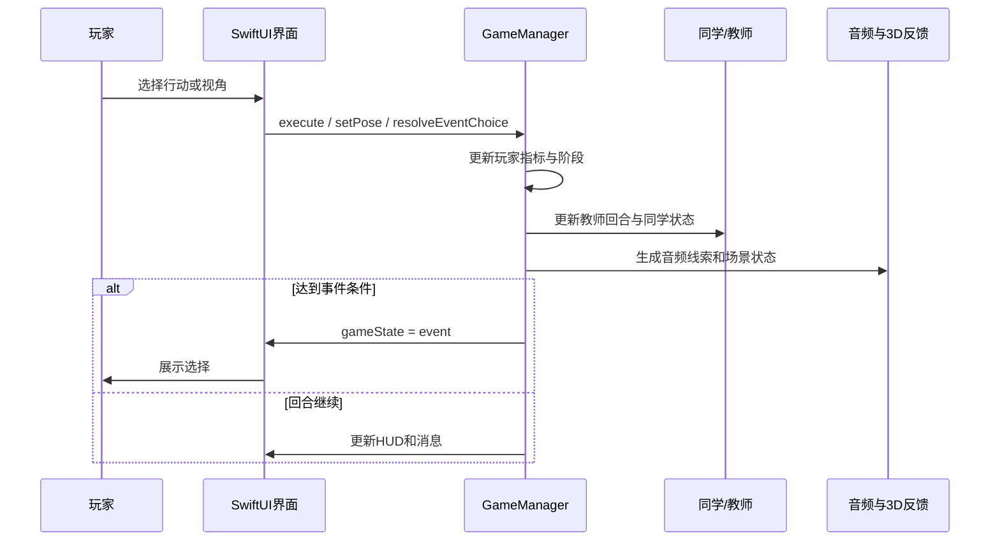

# 晚自习模拟器功能架构设计

## 1. 功能目标

晚自习模拟器通过 3D 第一视角教室、回合制行动、教师巡视、同学关系、心理指标、空间音频和结局报告，模拟晚自习制度压力下学生、教师与同伴之间的互动。README 将其描述为 macOS SwiftUI + SceneKit 版本，并列出心理能量、社会面具、支持网络、压力、暴露、作业、口渴、杯水、饥饿、如厕等 HUD 指标。来源：`README.md`。

## 2. 核心参与者

| 参与者 | 功能角色 | 依据 |
| --- | --- | --- |
| 玩家/学生 | 在座位中观察、行动、维持心理能量与任务进度；获准离座后可短时进入教室/走廊自由活动，课间可 5 分钟自由活动。 | `GameModels.swift`、`GameManager.swift`、`README.md` |
| 教师 | 班主任模式下选择位置、目标学生和干预方式，并受 KPI 压力、疲惫、信任、同理心影响。 | `GameModels.swift`、`GameManager.swift`、`README.md` |
| 同学/NPC | 具有个体档案、压力、关系、状态、怀疑和跨局记忆，可求助、举报、关心或掩护。 | `GameModels.swift:361`、`GameModels.swift:384`、`GameManager.swift:2021`、`README.md:47` |
| 系统 | 推进时间、触发事件、生成音频和视觉反馈、记录回放、生成结局报告。 | `GameManager.swift:988`、`GameManager.swift:1449`、`GameManager.swift:1867`、`ContentView.swift:708` |

## 3. 主要功能域

### 3.1 开局与制度参数

开局菜单展示标题和“开局制度参数”，用户可调整是否允许低声交流、时长、排名压力、巡视频率，并开始晚自习。来源：`ContentView.swift:39`、`ContentView.swift:50`、`ContentView.swift:57`、`ContentView.swift:133`、`ContentView.swift:138`。

`InstitutionSettings` 将时长换算为最大回合数和总分钟数，并把允许交流、排名压力、巡视频率纳入描述。来源：`GameModels.swift:274`、`GameModels.swift:280`、`GameModels.swift:284`、`GameModels.swift:288`。

### 3.2 回合与行动系统

玩家行动包括写作业、看手机、传纸条、观察、同桌、深呼吸、看窗外、喝水、吃零食、举手离座。每个行动都有图标和快捷键。来源：`GameModels.swift`。

`execute(_:)` 根据行动更新注意力、作业、心理能量、面具成本、支持、压力、暴露、口渴、杯水、饥饿、如厕等状态，并添加内心独白和音频线索。喝水每次降低口渴并消耗水杯容量；杯水不足时需要在自由活动中靠近饮水机补水。来源：`GameManager.swift`。

### 3.3 视角与感知系统

玩家视角包括前方、低头、抬头、左侧、右侧和后方；鼠标拖拽控制学生视角，坐着回头会显著增加暴露和压力。晚自习获准离座后进入 60 秒自由活动且每节课最多一次；课间进入 5 分钟自由活动。自由活动中按住空格沿当前朝向前进，按住 Shift 侧身通过窄缝。来源：`GameModels.swift`、`GameManager.swift`、`ClassroomSceneView.swift`。

学生相机在座位状态下映射头部视角，在自由活动状态下映射玩家位置和朝向；轻量碰撞系统限制桌椅、墙体、窗户、走廊柜子、邻班门和门厅边界。`ClassroomCoordinator` 接管鼠标拖拽、空格前进和 Shift 侧身输入。来源：`GameManager.swift`、`ClassroomSceneView.swift`。

### 3.4 教师系统

教师行动包括看全班、观察学生、公开提醒、低声提醒、关心询问、允许离开、选择性放过和坐下休息。教师状态根据 KPI 压力、疲惫、同理心、学生信任、咨询容量、表面秩序、真实风险和误判风险综合变化。来源：`GameModels.swift`、`GameManager.swift`。

`executeTeacherAction(_:)` 和 `teacherTurn()` 处理教师主动操作与自动教师回合，影响玩家压力、暴露、教师位置、同学状态和事件触发。来源：`GameManager.swift:336`、`GameManager.swift:452`、`GameManager.swift:540`、`GameManager.swift:549`。

### 3.5 NPC 与关系系统

同学由 5 排 x 4 列座位生成，玩家坐在第三排中间，生成 19 名同学；同学档案包括合作、守序、叛逆、同理心、焦虑、面具强度。来源：`GameManager.swift:2021`、`GameManager.swift:2025`、`GameManager.swift:2027`、`GameModels.swift:384`。

同学状态包括写题、焦虑、手机、困倦、看你、关心你、崩溃、掩护。`updateClassmates(after:)` 更新 NPC 压力与状态，候选函数触发求助、举报、跨局信任和跨局怀疑。来源：`GameModels.swift:410`、`GameManager.swift:1031`、`GameManager.swift:1360`、`GameManager.swift:1387`、`GameManager.swift:1317`。

### 3.6 事件与选择系统

事件类型包括被发现、老师关心、玩家崩溃、同桌哭泣、支持保护、停电、离座、孤独、手机通知、广播、敲门、同学求助/举报、记忆信任/怀疑。来源：`GameModels.swift:11`、`GameModels.swift:29`、`GameModels.swift:36`。

事件由 `presentEvent` 设置为 `.event` 状态，`resolveEventChoice(_:)` 根据选择 id 执行后果，随后恢复流程。来源：`GameManager.swift:1449`、`GameManager.swift:1453`、`GameManager.swift:1743`、`GameManager.swift:1747`。

### 3.7 结局、回放与心理教育

结局模型包含标题、正文、反思、真实故事、三方同理心、关系余波、指标分析、对照和支持资源。来源：`GameModels.swift:307`、`GameModels.swift:319`、`GameModels.swift:326`、`GameModels.swift:333`、`GameModels.swift:355`。

`recordSnapshot` 保存每回合表面现象、内心真实、教师解释和指标，结局界面展示夜间轨迹、数据对照、真实故事、三方同理心、关系余波、学生视角真相回放与心理支持资源。来源：`GameManager.swift:1867`、`GameManager.swift:1891`、`ContentView.swift:767`、`ContentView.swift:870`、`ContentView.swift:1017`、`ContentView.swift:1062`。

### 3.8 3D 场景与视觉反馈

3D 场景由 `ClassroomCoordinator` 构建，包含教室、家具、灯光、玩家桌面作业/笔/手部、老师、同学、墙钟、黑板、透明窗户、左侧户外、右侧贯通走廊、前后班级门牌、饮水机、可进入洗手间、一班前方左转门厅、户外台阶视野和持续旋转吊扇。来源：`ClassroomSceneView.swift`。

场景更新会同步老师路径、相机疲劳、黑板时间/作业/压力、时间氛围、桌面状态和 NPC 动画。来源：`ClassroomSceneView.swift:83`、`ClassroomSceneView.swift:101`、`ClassroomSceneView.swift:521`、`ClassroomSceneView.swift:527`、`ClassroomSceneView.swift:654`。

### 3.9 音频系统

音频系统包含持续心跳/环境源、真实素材短音与循环环境声、程序化短音回退、空间定位和声场雷达。来源：`SpatialAudioManager.swift:46`、`SpatialAudioManager.swift:77`、`SpatialAudioManager.swift:141`、`SpatialAudioManager.swift:203`、`ContentView.swift:301`。

`README` 明确音频线索覆盖脚步、纸张、手机、低语、椅子、抽泣、灯管、心跳、老师咳嗽/叹气等，并说明可选真实素材路径和缺失回退。来源：`README.md:75`、`README.md:76`、`README.md:78`、`README.md:79`、`README.md:81`。

## 4. 关键业务规则

| 规则 | 说明 | 来源 |
| --- | --- | --- |
| 时段划分 | 晚自习按总分钟数映射第一节、课间、第二节、第三节，第三节疲劳倍率更高。 | `GameModels.swift:67`、`GameModels.swift:80`、`GameModels.swift:89` |
| 注意力成本 | 不同视野区消耗不同注意力，低注意力影响聚焦并可增加压力。 | `GameModels.swift:160`、`GameManager.swift:1991`、`GameManager.swift:1999` |
| 身体需求 | 口渴、饥饿、如厕独立累积；喝水消耗杯水，饮水机补满杯水，洗手间消耗 10 秒并清空如厕。 | `GameModels.swift`、`GameManager.swift` |
| 离座限制 | 晚自习每节课最多获准离座一次，课间可 5 分钟自由活动。 | `GameManager.swift` |
| 崩溃风险 | 玩家崩溃风险由压力、面具成本、暴露、心理能量、支持计算。 | `GameModels.swift:269` |
| 教师制度压力 | KPI 与疲惫提高制度压力，同理心缓冲制度压力。 | `GameModels.swift:302` |
| 跨局记忆 | 关系、压力、怀疑和共享真相达到阈值时会保存到下一局。 | `GameManager.swift:1935`、`GameManager.swift:1941`、`GameManager.swift:1948` |

## 5. 异常与边界

*待确认*：当前没有单元测试验证事件分支和结局阈值，后续变更应优先补测试。依据：项目文件扫描未发现 `Tests/`。

*待确认*：`README.md` 提到已生成 `dist` 产物，但当前目录未包含该目录；如文档需要记录交付物，应确认产物所在位置。来源：`README.md:17`。

**推断**：由于音频素材目录只有 README，真实音频素材大概率未随源码提供，运行时将依赖程序化回退或用户 Application Support 目录。依据：`AudioCues/README.md:25`、`AudioLoops/README.md:15`、`SpatialAudioManager.swift:262`。
