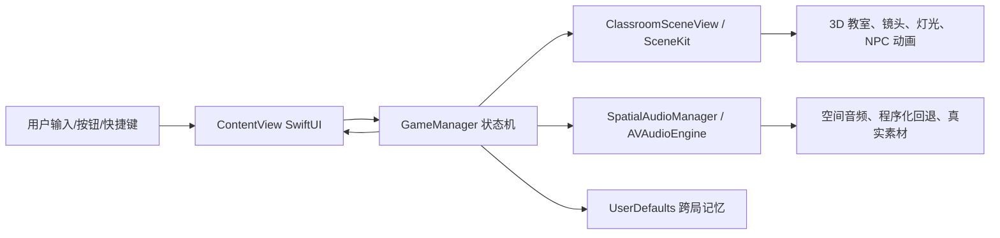

# 晚自习模拟器系统架构设计

## 1. 项目概览

晚自习模拟器是一个 macOS 桌面端 Swift Package 应用，目标产物为 `LateStudySimulator` 可执行程序。项目使用 SwiftUI 构建界面层，SceneKit 构建 3D 第一视角教室，AVFoundation/AppKit 提供空间音频与系统交互能力。来源：`Package.swift:1`、`Package.swift:5`、`Package.swift:11`、`README.md:1`、`README.md:3`。

项目入口为 `LateStudySimulatorApp`，在 `WindowGroup("晚自习模拟器 3D")` 中注入全局 `GameManager`，并设置最小窗口尺寸和隐藏标题栏样式。来源：`Sources/LateStudySimulator/LateStudySimulatorApp.swift:3`、`Sources/LateStudySimulator/LateStudySimulatorApp.swift:5`、`Sources/LateStudySimulator/LateStudySimulatorApp.swift:8`、`Sources/LateStudySimulator/LateStudySimulatorApp.swift:10`、`Sources/LateStudySimulator/LateStudySimulatorApp.swift:11`。

项目当前是 Git 仓库中的单模块 Swift Package，未使用 `.gitmodules`。源码目录为 `Sources/LateStudySimulator`，资源目录包括 `Resources/AudioCues` 和 `Resources/AudioLoops`，构建配置将两类音频资源复制进包资源。来源：`Package.swift`。

## 2. 技术栈与版本

| 类别 | 技术 | 依据 |
| --- | --- | --- |
| 语言与构建 | Swift Package，swift-tools-version 6.2 | `Package.swift:1`、`Package.swift:5` |
| 平台 | macOS v26 | `Package.swift:7`、`Package.swift:8`、`README.md:15` |
| UI | SwiftUI，Liquid Glass API | `Sources/LateStudySimulator/ContentView.swift:1`、`README.md:5`、`README.md:25` |
| 3D 渲染 | SceneKit / SCNView / SCNScene | `Sources/LateStudySimulator/ClassroomSceneView.swift:1`、`Sources/LateStudySimulator/ClassroomSceneView.swift:5`、`Sources/LateStudySimulator/ClassroomSceneView.swift:31` |
| 音频 | AVFoundation / AVAudioEngine / AVAudioEnvironmentNode | `Sources/LateStudySimulator/SpatialAudioManager.swift:2`、`Sources/LateStudySimulator/SpatialAudioManager.swift:6`、`Sources/LateStudySimulator/SpatialAudioManager.swift:7` |
| 本地持久化 | UserDefaults | `Sources/LateStudySimulator/GameManager.swift:40`、`Sources/LateStudySimulator/GameManager.swift:1960`、`Sources/LateStudySimulator/GameManager.swift:1975` |

`.app`、DMG、zip 等构建产物不入库；本地测试用应用包可由当前源码重新构建并替换可执行文件。来源：`README.md`、`.gitignore`。

## 3. 模块划分

| 模块 | 代码路径 | 职责 |
| --- | --- | --- |
| 应用入口 | `Sources/LateStudySimulator/LateStudySimulatorApp.swift` | 创建 SwiftUI App、注入 `GameManager`、配置窗口。来源：`LateStudySimulatorApp.swift:3`、`LateStudySimulatorApp.swift:5`、`LateStudySimulatorApp.swift:8` |
| UI/HUD | `Sources/LateStudySimulator/ContentView.swift` | 组织 SceneKit 视图、菜单、HUD、事件弹层、结局报告、回放与音频面板。来源：`ContentView.swift:6`、`ContentView.swift:8`、`ContentView.swift:15`、`ContentView.swift:28`、`ContentView.swift:32` |
| 3D 场景 | `Sources/LateStudySimulator/ClassroomSceneView.swift` | 将 `SCNView` 包装成 SwiftUI 视图，构建教室、学生、老师、镜头、灯光和场景动画。来源：`ClassroomSceneView.swift:5`、`ClassroomSceneView.swift:8`、`ClassroomSceneView.swift:66`、`ClassroomSceneView.swift:128` |
| 游戏状态机 | `Sources/LateStudySimulator/GameManager.swift` | 管理回合、视角、玩家/老师/NPC 状态、事件、音频线索、结局、跨局记忆。来源：`GameManager.swift:7`、`GameManager.swift:8`、`GameManager.swift:47`、`GameManager.swift:218`、`GameManager.swift:1453` |
| 领域模型 | `Sources/LateStudySimulator/GameModels.swift` | 定义游戏状态、事件、行动、玩家/老师/同学、结局、音频线索等数据结构。来源：`GameModels.swift:4`、`GameModels.swift:170`、`GameModels.swift:253`、`GameModels.swift:294`、`GameModels.swift:361` |
| 空间音频 | `Sources/LateStudySimulator/SpatialAudioManager.swift` | 管理音频引擎、环境声、事件短音、真实素材查找和程序化回退。来源：`SpatialAudioManager.swift:5`、`SpatialAudioManager.swift:27`、`SpatialAudioManager.swift:46`、`SpatialAudioManager.swift:141` |

## 4. 架构风格

项目是单进程桌面单体应用，采用“SwiftUI 表示层 + ObservableObject 状态中心 + SceneKit/AVFoundation 基础设施”的分层方式。`ContentView` 通过 `@EnvironmentObject` 读取 `GameManager`，`ClassroomSceneView` 通过 `@ObservedObject` 接收同一状态对象并同步 3D 场景。来源：`ContentView.swift:4`、`ContentView.swift:8`、`ClassroomSceneView.swift:6`、`ClassroomSceneView.swift:66`。

`GameManager` 作为主状态机，使用 `@Published` 暴露状态，让 SwiftUI 与 SceneKit 更新可观察。该类同时持有 `SpatialAudioManager`，因此音频由游戏状态驱动。来源：`GameManager.swift:7`、`GameManager.swift:8`、`GameManager.swift:13`、`GameManager.swift:18`、`GameManager.swift:39`。

**推断**：当前代码没有显式 Repository/Service 分层，领域逻辑集中在 `GameManager.swift`。依据是玩家行动、教师行动、事件选择、NPC 更新、结局计算、记忆读写均在该文件内声明。来源：`GameManager.swift:218`、`GameManager.swift:336`、`GameManager.swift:1031`、`GameManager.swift:1453`、`GameManager.swift:1960`。

## 5. 运行时进程与数据流

运行时只有一个 macOS GUI 进程。启动后 `LateStudySimulatorApp` 创建 `GameManager`，`ContentView` 渲染全屏 SceneKit 视图与 SwiftUI HUD，用户操作调用 `GameManager` 方法，状态变化再驱动 UI、3D 场景和音频更新。来源：`LateStudySimulatorApp.swift:5`、`ContentView.swift:6`、`ContentView.swift:57`、`GameManager.swift:47`、`ClassroomSceneView.swift:20`。

核心数据流：

1. `startGame()` 初始化回合、玩家、老师、同学、事件、回放和音频，然后进入 `.playing`。来源：`GameManager.swift:47`、`GameManager.swift:51`、`GameManager.swift:56`、`GameManager.swift:72`、`GameManager.swift:76`。
2. 玩家选择行动时，`execute(_:)` 调整玩家指标、消息和音频线索，然后更新同学、记录快照并进入教师回合。来源：`GameManager.swift:218`、`GameManager.swift:226`、`GameManager.swift:325`、`GameManager.swift:331`、`GameManager.swift:333`。
3. `ClassroomCoordinator.update(game:)` 根据同一状态更新老师路径、镜头、灯光、黑板、桌面、同学动画和相机疲劳反馈。来源：`ClassroomSceneView.swift:66`、`ClassroomSceneView.swift:83`、`ClassroomSceneView.swift:95`、`ClassroomSceneView.swift:101`、`ClassroomSceneView.swift:115`。
4. 音频由 `GameManager.addAudioCue` 调用 `SpatialAudioManager.playCue`，后者优先播放真实素材，缺失则生成程序化短音。来源：`GameManager.swift:1779`、`GameManager.swift:1785`、`GameManager.swift:1786`、`SpatialAudioManager.swift:141`、`SpatialAudioManager.swift:143`。

## 6. 状态与持久化

领域模型以值类型为主：`PlayerState` 保存心理能量、面具成本、支持、压力、暴露、作业、饥饿和如厕等指标；`TeacherState` 保存 KPI 压力、疲惫、同理心、位置和行为计数；`Classmate` 保存座位、档案、压力、关系、共享真相和怀疑值。来源：`GameModels.swift:253`、`GameModels.swift:294`、`GameModels.swift:361`。

跨局记忆由 `ClassmateMemory` 表示，包含关系延续、压力余波、怀疑延续、是否共享真相和上局是否被帮助。`GameManager` 使用 `UserDefaults` 以 `LateStudySimulator.ClassmateMemory.v1` 为 key 编解码保存。来源：`GameModels.swift:402`、`GameManager.swift:40`、`GameManager.swift:1935`、`GameManager.swift:1960`、`GameManager.swift:1967`。

*待确认*：当前没有迁移策略或版本兼容处理；如果未来调整 `ClassmateMemory` 字段，需要补充兼容策略。依据：`loadClassmateMemory()` 直接尝试 JSON 解码失败则返回空字典。来源：`GameManager.swift:1960`、`GameManager.swift:1964`。

## 7. 资源与音频架构

包内资源目录为 `Resources/AudioCues` 与 `Resources/AudioLoops`，构建配置通过 `.copy` 复制。来源：`Package.swift:17`、`Package.swift:18`、`Package.swift:19`。

音频短音支持 `wav`、`mp3`、`m4a`、`aif`、`aiff`、`caf`，短音基础名包括 `footstep`、`paper`、`phone`、`whisper`、`chair`、`crying`、`lights`、`heartbeat` 等。来源：`Sources/LateStudySimulator/Resources/AudioCues/README.md:7`、`Sources/LateStudySimulator/Resources/AudioCues/README.md:9`、`Sources/LateStudySimulator/Resources/AudioCues/README.md:25`。

循环环境声支持 `light_hum`、`pen_scratch`、`ceiling_fan`、`outside_night`，缺失时使用内置程序化环境层。来源：`Sources/LateStudySimulator/Resources/AudioLoops/README.md:7`、`Sources/LateStudySimulator/Resources/AudioLoops/README.md:9`、`Sources/LateStudySimulator/Resources/AudioLoops/README.md:15`。

`SpatialAudioManager` 会先查找用户 Application Support 目录，再查找包资源；真实素材缺失时回退到程序化波形。来源：`SpatialAudioManager.swift:262`、`SpatialAudioManager.swift:264`、`SpatialAudioManager.swift:267`、`SpatialAudioManager.swift:282`、`SpatialAudioManager.swift:330`。

## 8. 部署与构建

README 指定使用 `swift run LateStudySimulator` 启动，当前环境说明为 Command Line Tools，不能使用 `xcodebuild`。来源：`README.md:7`、`README.md:10`、`README.md:13`。

构建目标是 Swift Package executable target，目标平台 macOS v26；完整运行需要支持 Liquid Glass API 的 SDK/运行环境。来源：`Package.swift:8`、`Package.swift:11`、`Package.swift:14`、`README.md:15`。

*待确认*：未发现 Docker、Kubernetes、CI/CD、服务端进程、数据库、缓存或消息队列配置；按本地桌面应用处理。来源：项目文件扫描仅包含 `Package.swift`、`README.md`、`Assets/**`、`Sources/**` 与设计文档。

## 9. 架构风险与约束

| 风险/约束 | 说明 | 来源 |
| --- | --- | --- |
| 平台约束高 | 目标 macOS v26 且依赖 Liquid Glass API，低版本 SDK/系统可能无法构建或运行。 | `Package.swift:8`、`README.md:5`、`README.md:15` |
| 状态机集中 | 大量业务逻辑集中在 `GameManager.swift`，后续扩展事件池、结局或 NPC 逻辑时文件复杂度会继续上升。 | `GameManager.swift:218`、`GameManager.swift:336`、`GameManager.swift:1031`、`GameManager.swift:1453` |
| 音频素材可选 | 真实音频缺失时可回退程序化声音，但最终体验依赖素材覆盖率。 | `README.md:78`、`README.md:79`、`SpatialAudioManager.swift:27` |
| 测试缺失 | 当前扫描未发现 `Tests/` 目录或自动化测试配置。 | 项目文件扫描 |
| 构建产物不入库 | `.app` 应用包体积较大且属于派生产物，应通过本地构建生成，不提交到远端仓库。 | `.gitignore`、`README.md` |

## 10. 后续建议

1. 补充 `Tests/`，优先覆盖 `StudyPeriod.period`、`PlayerState.breakdownRisk`、`InstitutionSettings.maxTurns`、事件选择后果和记忆编解码。
2. 将 `GameManager` 中事件池、结局计算、NPC 压力更新拆分为内部协作者，以降低单文件维护成本。
3. 补齐真实音频素材并建立素材覆盖检查脚本。
4. *待确认*：是否允许创建项目根 `AGENTS.md`；该文件是初始化基线的一部分，但本次按技能写入边界先未创建。
