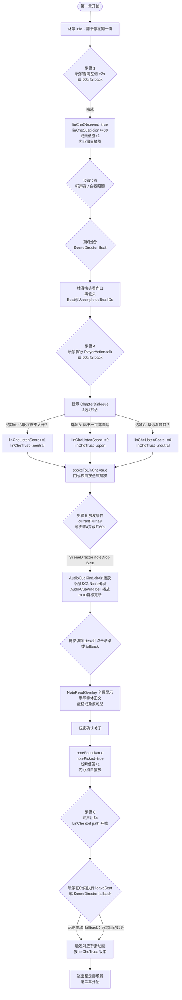

# F-10 林澈 NPC 与纸条事件 — 业务流程

> 状态：final / accepted

## 主流程

第一章步骤 1→4→5→6 构成 F-10 的核心链路，林澈 NPC 是贯穿全链的状态节点。

## 边界与兜底

**步骤 1（看向林澈）：**
- 30 秒未切换至 `.left` 视角：HUD 高亮左侧目标 + 方向字幕加强
- 90 秒仍未完成：苏念自然向左瞥，SceneDirector 以 `flags=["softNoticed"]` 提交步骤结果，状态写入与玩家主动完成完全相同

**步骤 4（对话）：**
- 90 秒未执行 `talk`：林澈先开口「我出去一下」，SceneDirector 以最低信息量版本（`linCheListenScore+=0`、`linCheTrust=.neutral`）提交步骤完成
- 对话 overlay 打开后暂停 SceneDirector 计时（加入 `.event` pause reason）

**步骤 5（纸条事件）：**
- `noteDrop` Beat 已在 `completedBeatIDs` 中：静默忽略，不重播任何音效或动画
- 玩家未切换到 `.desk` 且未点击：SceneDirector 另行注册 fallback Beat（纸条滑落到桌边更显眼位置），不强制关闭玩家当前视角
- 存档恢复时 `notePicked==true`：纸条 SCNNode 不可见，overlay 不重放，直接处于步骤 6 等待状态

**步骤 6（跟随林澈）：**
- 林澈路径动画（约 8 秒）结束前玩家未行动：SceneDirector 自动推进，苏念起身（独白：「我不知道为什么，就是跟着走了」），效果与玩家主动操作相同
- `notePicked==false` 时步骤 6 不允许触发，SceneDirector 先等待步骤 5 完成

## 与其他特性的交互点

| 时机 | 调用方向 | 说明 |
|---|---|---|
| 步骤 1 完成后 | F-10 → F-09 | 触发内心独白「林澈今天只翻了一页书」并更新线索便签 |
| 步骤 4 完成后 | F-10 → F-09 | 根据选项触发对应内心独白 |
| 步骤 5 纸条事件触发前 | F-02 → F-10 | SceneDirector 在满足条件后调用 `GameManager` 发出 `noteDrop` 事件 |
| 步骤 5 完成后 | F-10 → F-09 | 触发内心独白「这不是传给我的。但我看见了。」并更新线索便签 |
| 步骤 6 林澈起身 Beat | F-02 → F-10 | SceneDirector 驱动林澈路径动画；F-10 在 `ClassroomCoordinator` 内响应 `scenePresentation` 变化 |
| 第一章结束 → 第二章 | F-10 → F-11 | `linCheTrust` 值传递，第二章读取决定镜像空间对话版本；F-10 不直接调用 F-11，由 `GameManager.transitionChapter` 转发 |
| 视角停留判定 | F-08 → F-10 | F-08 的 `dwellTimer` 达阈值后向 `GameManager` 报告聚焦事件，F-10 的步骤 1/2 判定建立在此之上 |
