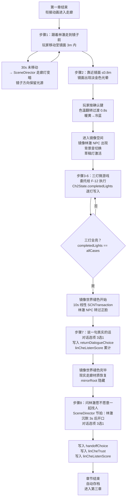

# F-11 镜像空间场景 — 业务流程

> 状态：final / accepted

## 主流程

### 章节完成门禁

`Ch2State.completedLights == Set(MirrorLightID.allCases)` 且 `Ch2State.handoffChoice != nil`。

## 边界与兜底

| 场景 | 兜底处理 |
|---|---|
| 步骤 1 玩家 30s 未移动 | SceneDirector 降暗走廊灯，只保留镜子方向光源，引导方向；不自动代替玩家移动 |
| 步骤 2 玩家不按确认键 | 15s 后 SceneDirector 触发：林澈 NPC 轻轻碰触镜面，发出声音引导玩家靠近 |
| 微游戏（F-12）执行中暂停 | `activePauseReasons` 插入 `.pauseMenu`，SceneDirector 冻结；褪色进度归一化保存；恢复后从中断点继续 |
| 色温翻转中应用失焦 | `normalizedProgress` 写入 `ScenePresentationState.transition`；恢复后 `ColorTemperatureAnimator` 从该进度继续 |
| 步骤 7/8 对话超时未选择 | 超过 30s 无操作时加强引导提示（HUD 高亮选项区域）；不自动代替玩家选择（对话有剧情影响，不设 fallback 自动提交） |
| 存档恢复后进入已完成的灯位置 | `completedLights` 和 `currentLight` 由 `GameManager` 提供，`ClassroomCoordinator.updateMirrorScene` 按已完成状态确定性重建光路和灯光强度，不重放过渡动画 |
| 读档时 `completedLights` 与 `currentLight` 不一致 | 存档校验拒绝，回退 `lastValid`；若也不可用则重置为 `Ch2State()` 并从步骤 1 重新开始 |

## 与其他特性的交互点

| 时机 | 调用方向 | 说明 |
|---|---|---|
| 进入第二章时 | F-01 → F-11 | `GameManager.startChapter(.mirror)` 触发，`ChapterRuntimeState` 切换为 `.mirror(Ch2State())` |
| 进入镜像空间 | F-11 → F-04 | `ScenePresentationState.transition = .colorTemperatureFlip(duration: 0.8)` 通知 ClassroomCoordinator 执行切换 |
| 激活每盏灯 | F-11 ↔ F-12 | F-11 通过 `scenePresentation.objectiveTargetID` 告知当前灯目标；F-12 完成微游戏后调用 `completeStep` 写入 `completedLights`；F-11 监听 `Ch2State` 变化更新光路和灯亮状态 |
| 步骤 7/8 对话选择 | F-11 → F-01 | `completeStep` 原子写入 `handoffChoice`、`linCheTrust`、`linCheListenScore`，供第三章 F-14/F-15 读取 |
| 暂停/恢复 | F-02 → F-11 | SceneDirector 通过 `activePauseReasons` 集合冻结/恢复本章 Beat；F-11 的色温动画和褪色动画在 `update(game:)` 中检查集合状态 |
| 章节转换到第三章 | F-11 → F-01 | `transitionChapter(from: .mirror, result:)` 校验完成门禁，F-11 清理 `mirrorRoot` 节点状态 |
