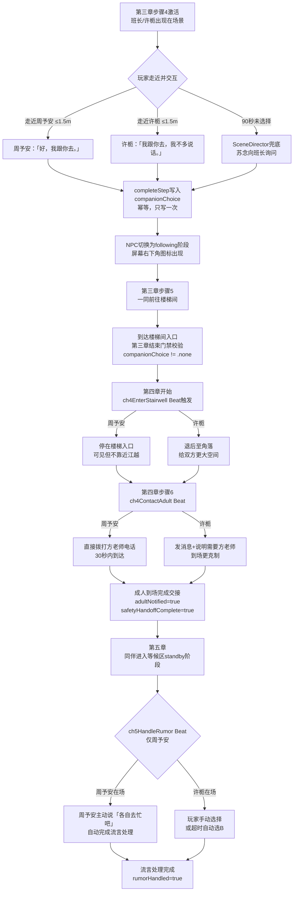

# F-14 同伴 NPC 系统 — 业务流程

> 状态：final / accepted

## 主流程

## 边界与兜底

**选择超时（第三章步骤4，90秒未操作）**：SceneDirector 触发兜底，苏念自动走向班长周予安完成选择，写入 `companionChoice = .zhouYuAn`，标记 `flags = ["softNoticed"]`，主线不中断。许栀路径不会出现于兜底，兜底始终选班长（班长在教室门口更易触及）。

**章节门禁拦截**：若 `companionChoice == .none` 时尝试进入第四章，`GameManager.transitionChapter` 拒绝并保持第三章当前状态，不会出现无同伴的第四章状态。

**存档恢复**：读档后 `ClassroomCoordinator` 依据 `checkpointID` 确定性重建 `CompanionPhase` 和同伴锚点位置。第三章选择后的检查点映射到 `following` 阶段；楼梯间检查点映射到 `positioned`；第五章等候区映射到 `standby`。不重复播放选择对话。

**同伴卡墙或路径失败**：`CompanionFollowBehavior` 检测到同伴位置与玩家距离 >5m 时，直接传送到玩家后方 1.5m 锚点，不显示传送动画，保证视觉连贯。

**方老师未及时到达（第四章倒计时归零）**：倒计时归零但 `adultContactInitiated == false` 时，`Ch4FallbackDirector` 自动触发 `ch4ContactAdult` Beat，与同伴类型无关，方老师必然到场。

## 与其他特性的交互点

| 时机 | 本特性动作 | 依赖特性 |
|---|---|---|
| 第三章步骤4热点触发 | 写入 `companionChoice`，切换 NPC 跟随状态 | F-13（热点交互机制） |
| 第三章结束门禁 | 校验 `companionChoice != .none` | F-01（章节转移门禁 `transitionChapter`） |
| 第四章 Beat `ch4EnterStairwell` | 同伴定位到差异锚点 | F-02（SceneDirector Beat 调度） |
| 第四章 Beat `ch4ContactAdult` | 触发差异联络动画，推进 `adultContactInitiated` | F-16（江越对话与信任系统） / F-17（安全路线分流） |
| 第五章 Beat `ch5HandleRumor` | 周予安自动完成流言处理，幂等写入 `rumorHandled` | F-18（咨询室等候与隐私保护） |
| 全程同伴图标 HUD | 读取 `companionChoice` 渲染图标 | F-03（主线任务 HUD） |
