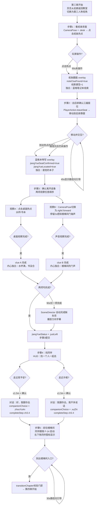

# F-15 纸条调查链 — 业务流程

> 状态：final / accepted

## 主流程

## 边界与兜底

| 步骤 | 异常路径 | 兜底行为 |
|---|---|---|
| 步骤1（纸条背面）| 90s未操作 | SceneDirector 触发苏念自行翻看，结果相同，标记 `flags=["softNoticed"]` |
| 步骤2（座位确认）| 45s未移动 | 路径光出现；仍不操作时苏念自动走到座位并执行检查 |
| 步骤3（双观察）| 90s仅完成一项 | 缺失项由 SceneDirector 自动补全（播放楼梯间门轴声或低头看桌面），附方向字幕 |
| 步骤4（同伴选择）| 无超时自动兜底 | 章节守护 Beat（软上限 10 分钟）触发强化引导：HUD 高亮两位同伴位置；不自动选择 |
| 步骤5（前往楼梯间）| 30s不移动 | 路径光提示；苏念不自动走，保留玩家主动性 |
| 存档恢复 | 任意步骤恢复 | 已完成的观察 flag 不重置；`companionChoice` 已写入时跳过步骤4；同伴 NPC 按 `companionChoice` 确定性重建位置 |
| 章节门禁失败 | `companionChoice == .none` 时触发楼梯间入口 | `transitionChapter` 拒绝，HUD 提示"先找一个人一起去" |

## 与其他特性的交互点

| 时机 | 调用方向 | 说明 |
|---|---|---|
| 步骤1：纸条翻面 | F-15 → F-09 | 触发内心独白（`InnerMonologue`）和线索便签（`ClueCard`）显示 |
| 步骤2-5：教室内移动 | F-15 使用 F-13 | `guidedThirdPerson` 相机模式由 F-13 提供，本特性只调用切换接口 |
| 步骤4：同伴确认后 | F-15 启动 F-14 | `companionChoice` 写入后通知 `CompanionNPC` 激活跟随行为 |
| 步骤5：到达楼梯间 | F-15 → F-16 | `transitionChapter` 校验完成后，携带 `companionChoice` 和 `Ch3State` 初始化第四章 |
| 第四章步骤2/6 | F-16 读取 F-15 结果 | 同伴选择影响江越初次对话压力感和成人联络速度 |
| 第五章步骤3/4 | F-18 读取 F-15 结果 | 同伴图标和流言处理中的班长/许栀 NPC 行为取决于 `companionChoice` |
