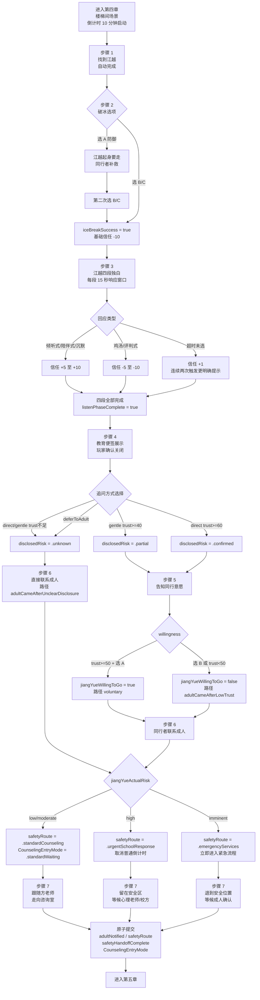

# F-16 江越对话与信任系统 — 业务流程

> 状态：final / accepted

## 主流程

## 边界与兜底

**破冰失败（步骤 2 选 A）**
- 江越起身，同行者从侧面说"先别走"，给玩家第二次选择（只保留 B/C）
- 第二次任意选择后强制通过，`iceBreakSuccess = true`，信任基础值 -10
- 主线不断

**倾听超时（步骤 3）**
- 每段 15 秒未选择，自动提交"超时"回应，信任 +1
- 连续两次超时后 HUD 提示更明确的操作指引
- 四段全部播放后无论信任值多少均标记 `listenPhaseComplete`

**倒计时归零（步骤 6 前）**
- SceneDirector 自动触发：同行者（周予安/许栀）主动联系方老师
- 等效于玩家完成步骤 6，写入 `adultContactInitiated = true`

**信任不足路径**
- `jiangYueTrustValue < 40` 且选 gentle：`disclosedRisk = .unknown`
- `jiangYueTrustValue < 60` 且选 direct：`disclosedRisk = .unknown` 或 `.partial`
- `.unknown` 路径：HUD 更新为"他不想说，但我不能假装没听见"，直接进入步骤 6
- 任何披露状态下主线均可到达成人接管

**存档恢复**
- 从 `pendingBeatRemainingTimes` 恢复倒计时剩余秒数
- 从 `Ch4State` 恢复对话阶段（已完成的独白段落不重播）
- `activePauseReasons` 中移除 `.appInactive/.systemSleep`，按当前应用状态重新添加
- 江越 NPC 的 SCNNode 姿态由 `ClassroomCoordinator.update(game:)` 依据 `Ch4State` 确定性重建

**应用失焦/系统休眠**
- `activePauseReasons.insert(.appInactive/.systemSleep)`
- 倒计时、对话响应窗口、SceneDirector Beat 全部冻结
- 恢复后从剩余时间继续，不重新计时，已触发 Beat 不重放

**高危路线（.high/.imminent）**
- 触发后立即取消普通课间倒计时 Beat
- 安全响应 Beat 序列优先级覆盖普通剧情 Beat
- `.emergencyServices` 路线不展示处置细节，玩家只需退到安全锚点等待成人确认

## 与其他特性的交互点

**被调用（本特性读取前章输出）**
- F-13 第三章：`companionChoice`（`.zhouYuAn/.xuZhi`）决定同行者行为差异（周予安速度更快，许栀给江越更多空间）
- F-12 第二章：`linCheListenScore >= 3` 给信任基础分 +5（"苏念练习过倾听"）
- F-10 第一章：两条明确观察 + 捡到纸条给信任基础分 +10

**调用其他特性（本特性输出）**
- F-17 第五章：`safetyRoute` 决定第五章入口模式 `CounselingEntryMode`；`jiangYueResolutionPath` 影响第五章等候区内容
- F-18 第六章：`jiangYueResolutionPath` 参与多结局条件判断；`adultNotified` 影响支持网络图节点文字
- 存档系统：`safetyRoute` + `CounselingEntryMode` 原子写入，读档时做一致性校验；不一致恢复 `lastValid`
- `SceneDirector`：注册步骤 2-7 的 Beat 定义和倒计时；高危路线接管时取消普通 Beat 序列
