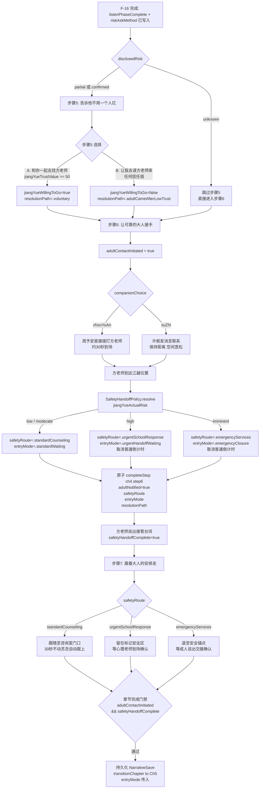

# F-17 安全路线分流与成人交接 — 业务流程

> 状态：final / accepted

## 主流程

## 边界与兜底

**倒计时归零（步骤 < 6）**
SceneDirector 的 `Ch4FallbackDirector` 检测到课间倒计时归零且 `adultContactInitiated == false`，自动触发同伴联络行为（等效于玩家触发步骤 6），提交 `adultContactInitiated = true`，主线不断。

**步骤 5 未操作（15 秒超时）**
SceneDirector 默认选择选项 B（「让我去请方老师来」），写入 `jiangYueWillingToGo = false`、`resolutionPath = .adultCameAfterLowTrust`，自动进入步骤 6。

**`disclosedRisk == .unknown` 路径**
直接跳过步骤 5，路径固定为 `adultCameAfterUnclearDisclosure`，方老师到场后成人接管；`safetyRoute` 仍由编剧风险事实决定，不因信息不足降为低风险处理。

**存档恢复时处于步骤 6 中间**
- 若 `adultContactInitiated == true` 但 `safetyHandoffComplete == false`：恢复到方老师正在前往的场景节点，重建 `TeacherArrivalSequence` 动画，不重新发起联络
- 若 `safetyHandoffComplete == true` 但章节未切换：直接触发步骤 7 并重建对应受限视角 Beat

**高危/即时危险路线触发时**
`SafetyResponseBeat` 优先级高于普通剧情 Beat，立即取消 `CountdownTimer`，进入专项台词序列；该序列的脚本文件缺失时构建期报错，不以普通路线静默替代。

## 与其他特性的交互点

| 交互对象 | 交互时机 | 方向 |
|---|---|---|
| F-16（江越对话与信任系统） | F-16 完成 `listenPhaseComplete` 并写入 `riskAskMethod`、`disclosedRisk` 后，F-17 步骤 5/6 才可激活 | F-16 → F-17 |
| F-14（同伴 NPC 系统） | 步骤 6 触发时读取 `companionChoice`，驱动 `CompanionNPC` 执行联络动作 | F-17 读 F-14 状态 |
| F-02（SceneDirector 节拍系统） | 步骤 7 注册受限跟随 Beat；高危路线插入 `SafetyResponseBeat` 并取消普通倒计时 | F-17 向 F-02 注册 |
| F-18（咨询室等候与隐私保护） | F-17 原子提交中写入的 `safetyRoute` 和 `CounselingEntryMode` 是 F-18 的唯一入口条件 | F-17 → F-18 |
| F-01（叙事状态机）| `GameManager.completeStep` 和 `transitionChapter` 由 F-01 提供幂等门禁 | F-17 调用 F-01 |
