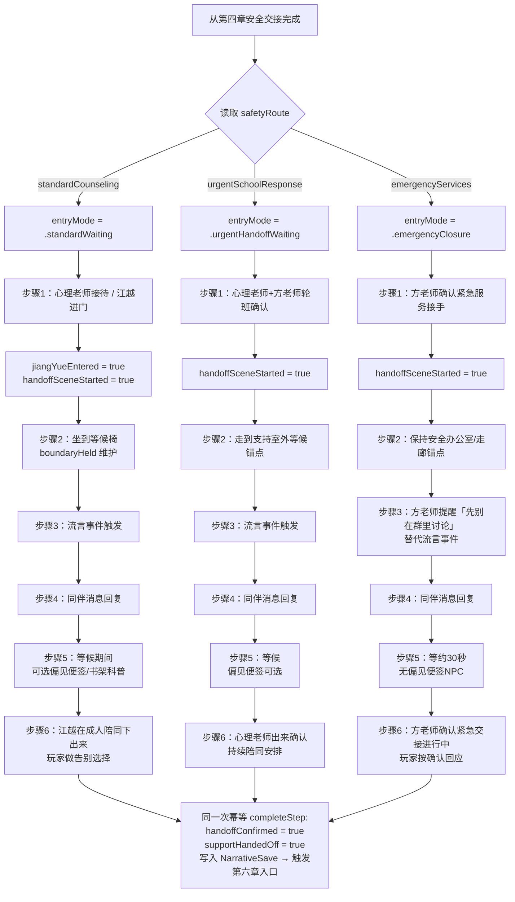
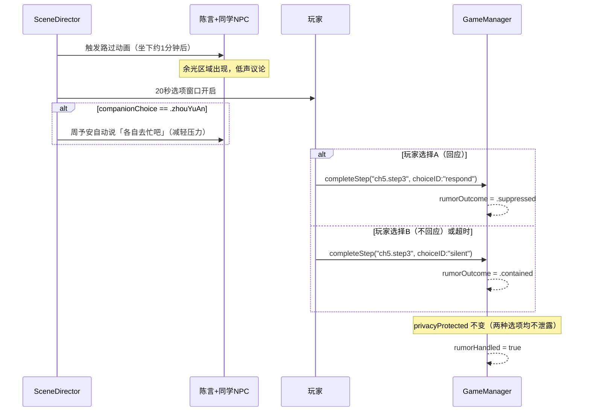

# F-18 咨询室等候与隐私保护 — 业务流程

> 状态：final / accepted

## 主流程

**流言事件子流程（步骤 3，标准/高风险路线）：**

## 边界与兜底

| 场景 | 处理方式 |
|---|---|
| 玩家靠近咨询室门（标准/高风险路线） | 距离 ≤0.5m 且停留 ≥3s → 内心独白 + camera pull-back；`boundaryHeld` 不变为 `true` |
| 流言选项 20 秒超时 | SceneDirector 自动提交 `.contained`（不回应路径），`rumorHandled = true` |
| 偏见便签玩家不操作 | 5 秒后自动消失，不计入任何完成门禁，不影响主线 |
| 同伴消息玩家不回复 | 章节软上限压缩等候 Beat 后，SceneDirector 提交默认回复选项（选项 A），写入 `companionMessageReplied = true` |
| 即时危险路线出现流言 NPC | 即时危险路线不生成路过 NPC；改为方老师说出「先别在群里讨论刚才的事」，`rumorHandled = true` 由该 Beat 完成 |
| 章节软上限 15 分钟超出 | 标准路线：SceneDirector 压缩等候等待时间；高风险/即时危险路线：按成人确认 Beat 直接收束 |
| 读档时 `entryMode` 与 `safetyRoute` 不一致 | 章节一致性校验拒绝，恢复 `lastValid`，显示一次非阻塞提示 |
| 应用在等候期间失焦/系统休眠 | `activePauseReasons` 插入对应暂停原因，所有受控 Beat 冻结，偏见便签倒计时暂停；恢复后继续剩余时间 |

## 与其他特性的交互点

| 时机 | 方向 | 交互特性 | 说明 |
|---|---|---|---|
| 章节入口 | F-17 → F-18 | F-17 安全路线分流 | `safetyRoute` 已持久化后 `startChapter(.counseling)` 读取并映射 `entryMode` |
| 步骤 3 流言事件 | F-18 使用 | F-14 同伴 NPC | `companionChoice == .zhouYuAn` 时周予安执行自动台词 Beat |
| 步骤 3 偏见便签 | F-18 使用 | F-09 内心独白/线索便签 | `BiasCardSystem` 复用 `InnerMonologue` 触发路径与 `liquidGlassPanel` 样式 |
| 步骤 6 完成 | F-18 → F-19 | F-19 终章入口 | `supportHandedOff = true` 写入后，`transitionChapter(.epilogue)` 门禁通过，苏念走向走廊大镜子 |
| 等候区相机 | F-18 使用 | F-03 叙事相机 | `NarrativeCameraMode.waitingSeated` 复用第一章固定坐姿逻辑，切换场景根节点 |
| 暂停/恢复 | F-18 使用 | F-02 SceneDirector | 流言事件窗口、偏见便签倒计时、成人等候 Beat 均受 `activePauseReasons` 冻结管理 |
