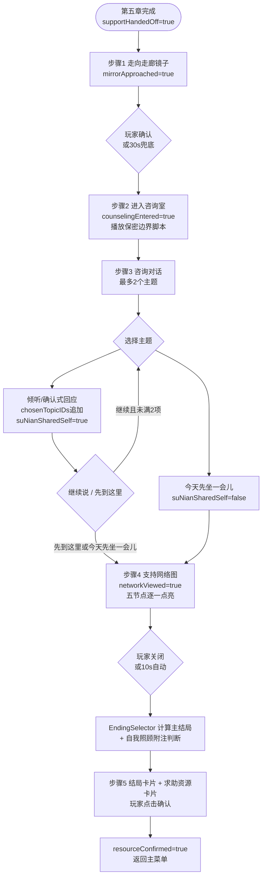
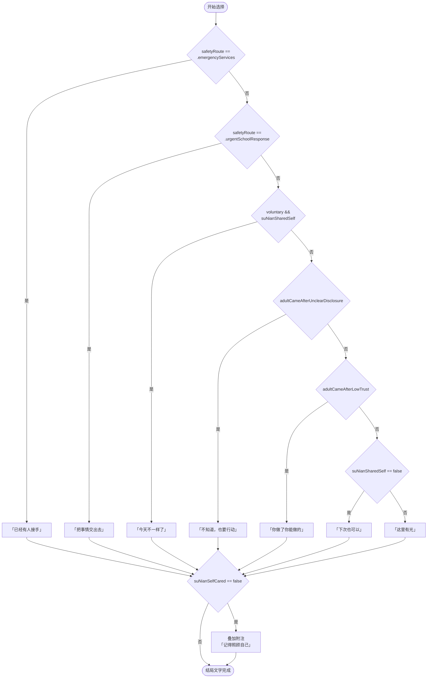

# F-19 苏念咨询与支持网络结局 — 业务流程

> 状态：final / accepted

## 主流程

### EndingSelector 优先级

## 边界与兜底

**步骤 1 兜底（30s 未操作）：** SceneDirector 自动让苏念走向镜子并触发确认，完成 `mirrorApproached=true`，进入步骤 2。

**步骤 2 保密边界脚本缺失：** Release 构建门禁拦截打包，Debug 构建显示占位文本并记录警告，不阻塞运行。

**步骤 3 玩家未选择任何主题：** 自动以「今天先坐一会儿」作为最终选择提交，`suNianSharedSelf=false`，进入步骤 4。

**步骤 4 玩家直接跳过网络图：** 允许立即关闭；10s 无操作后自动继续，`networkViewed=true` 仍写入。

**步骤 5 求助资源不可跳过：** `resourceConfirmed` 是章节唯一门禁，无任何超时自动完成逻辑；SceneDirector 不为此步骤注册 fallback Beat。

**存档恢复：** 恢复时 `EndingSelector` 从当前 `GameNarrativeState` 重新派生结局，不需要存档 `EndingType`。若 `counselingEntered=true` 但 `chosenTopicIDs` 为空，认为读档在步骤 3 开始前，从步骤 3 入口重建。

**多重暂停交错：** 步骤 1-4 的 SceneDirector Beat 遵循 F-02 定义的 `activePauseReasons` 集合冻结机制；步骤 5 无 Beat，恢复暂停后直接还原资源卡片显示状态。

## 与其他特性的交互点

| 调用方向 | 触发时机 | 说明 |
|---|---|---|
| F-19 读取 F-01 | 章节入口校验 | 检查 `supportHandedOff == true`，不满足则门禁拦截 |
| F-19 读取 F-01 | `EndingSelector.select` | 读取 `safetyRoute`、`jiangYueResolutionPath`、`suNianSharedSelf`、`suNianSelfCared` |
| F-19 读取 F-01 | `SupportNetworkView` 渲染 | 读取 `linCheListenScore`、`companionChoice`、`linCheTrust` 派生节点强度 |
| F-19 写入 F-01 | 步骤 3 完成 | `completeStep` 幂等提交 `suNianSharedSelf` 到 `GameNarrativeState` |
| F-19 调用 F-02 | 步骤 1 镜面涟漪 | 注册 SceneDirector Beat，驱动 `mirrorRipple` 转场 |
| F-19 被 F-20 依赖 | 全局集成 | F-20 要求本特性可通关后才能进行六章转场和音频完整测试 |
| F-19 被 F-21 依赖 | iPad 预置 | `SupportNetworkView` Canvas 和 `SupportResourceView` 需在 F-21 中验证 iPad 布局 |
