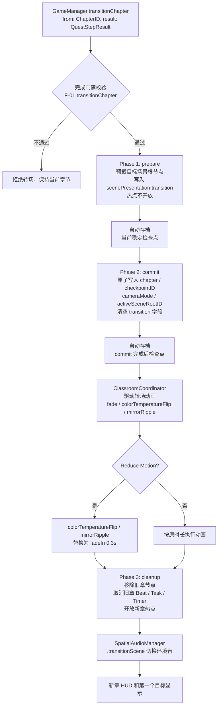
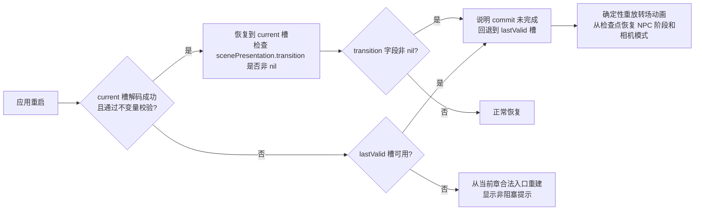
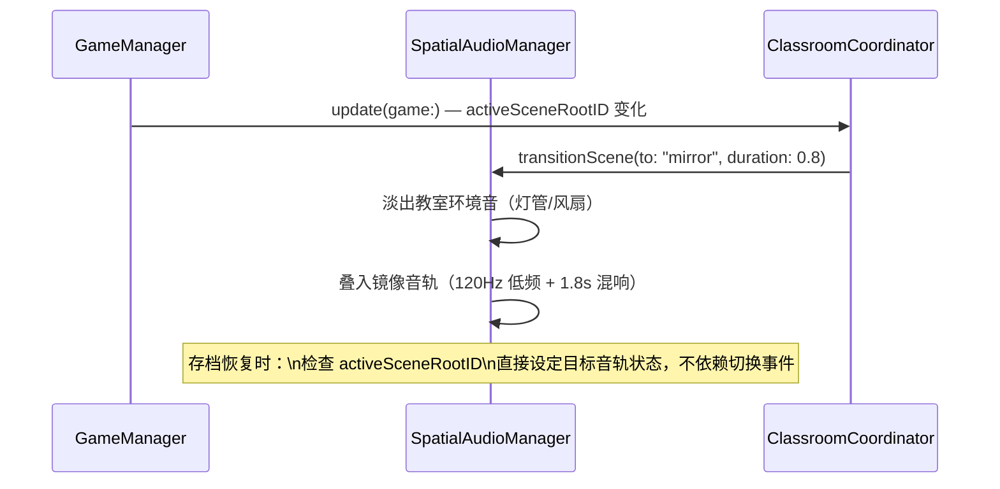

# F-20 全局集成：转场/音频/无障碍 — 业务流程

> 状态：final / accepted

## 主流程

### 章节转场三阶段

### 转场期间崩溃恢复流程

### 音频场景切换

## 边界与兜底

| 场景 | 处理方式 |
|---|---|
| 转场中应用失焦（`.appInactive` 进入 `activePauseReasons`） | 转场动画冻结；`cleanup` 延迟到恢复后执行；存档不落在冻结中间帧 |
| `commit` 写入成功但 `cleanup` 未执行时崩溃 | `current` 槽 `transition` 字段为 nil（commit 已清空），正常恢复到新章；`cleanup` 在首次 `update(game:)` 时补执行 |
| `prepare` 阶段崩溃 | `current` 槽 `transition` 非 nil，回退 `lastValid`，重新从旧章触发转场 |
| 存档恢复到镜像空间场景 | `ClassroomCoordinator` 初始化时检查 `activeSceneRootID == "mirror"`，直接叠入镜像音轨，不等待 `transitionScene` 事件 |
| Reduce Motion 在转场动画进行中被切换 | 当前帧动画完成后才应用新设置；不中断正在执行的 SCNAction |
| `SupportResourceCatalog` 审核日期超期 | `#if DEBUG` 输出 `#warning`；不影响游戏逻辑或 Release 打包 |

## 与其他特性的交互点

| 时机 | 调用方向 | 说明 |
|---|---|---|
| 每章步骤完成 → 章节切换 | F-01 门禁 → F-20 三阶段 | `transitionChapter` 先通过 F-01 完成门禁，再进入 F-20 的 prepare/commit/cleanup |
| `scenePresentation.activeSceneRootID` 变化 | F-04（叙事相机）→ F-20（音频） | 镜像空间不是独立章节，靠 `activeSceneRootID` 变化触发音频切换；F-04 负责镜头，F-20 负责音频 |
| SceneDirector Beat 执行 | F-02 → F-20（转场动画） | SceneDirector 请求 `GameManager` 执行转场动作，F-20 驱动动画，Beat 计时不依赖动画完成回调 |
| 辅助功能设置变更 | F-07（存储）→ F-20（消费） | `AccessibilitySettings.reduceMotion` 由 F-07 持久化，F-20 在每次动画开始前读取；字幕开关通过 `SpatialAudioManager` 全局传播 |
| 第六章求助资源展示 | F-19 → F-20（审核门禁） | F-19 调用 `SupportResourceCatalog`，F-20 在 `validate()` 中提供审核日期检查逻辑 |
| VoiceOver 焦点管理 | F-20 → 各章 SwiftUI 组件 | 本特性在各章 overlay（微游戏/纸条/对话）关闭时指定焦点回退目标，不由各章自行实现 |
