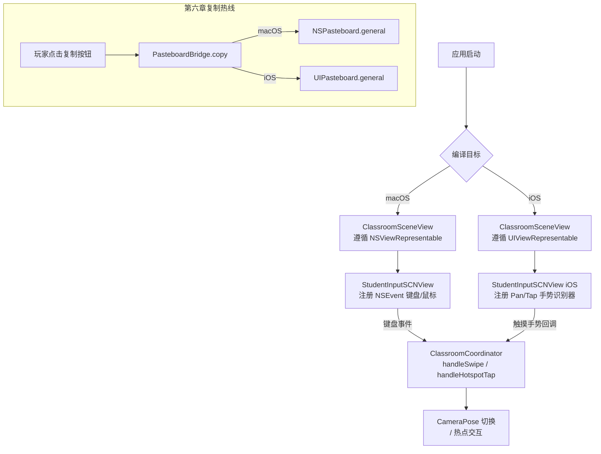

# F-21 多平台适配基础（iPad 预置） — 业务流程

> 状态：final / accepted

## 主流程

本特性无玩家可见的业务流程，核心是编译时平台分发和运行时输入路径选择。

## 边界与兜底

**iOS 编译失败**
- 若某文件引用了未被隔离的 AppKit 专有类型，Swift 编译器直接报错
- 兜底：施工前完整扫描所有 AppKit import，建立清单后逐文件处理，不允许"先跑通再补"

**Liquid Glass API 在 iOS 不可用**
- `liquidGlassPanel(cornerRadius:tint:)` 辅助器在 `#available(iOS 18, *)` 为 false 时，降级为 `.background(.ultraThinMaterial)` + `cornerRadius` 修饰符
- 不影响 macOS 路径；游戏逻辑和叙事流程完全不感知此 fallback

**`SCNView` 系统手势干扰**
- 在 `makeUIView` 中 `scnView.allowsCameraControl = false`，禁用系统默认的旋转/缩放手势
- 若玩家在 iPad 上误触发系统级返回手势（从左边缘滑入），iOS 系统会先弹出 app 切换，`activePauseReasons.insert(.appInactive)` 在 `scenePhase` 变化时自动触发（F-01/F-02 已有的暂停机制），无需本特性额外处理

**存档在 iOS/macOS 间迁移**
- `NarrativeSave.v1` 结构不变，macOS 存档可在 iOS 上读取（前提是存档文件可被访问）
- 首版 iPad 预置不承诺跨平台存档同步，iCloud 同步策略留待后续阶段

## 与其他特性的交互点

- **F-04（叙事相机模式与场景呈现）**：F-04 引入的所有新场景根节点和相机模式均通过 `ClassroomCoordinator` 管理；F-21 确保 `ClassroomCoordinator` 的 iOS 输入路径与 F-04 的相机切换逻辑衔接正确
- **F-07（辅助设置面板）**：F-21 在 iOS 运行时修正 `AccessibilityPreferences.keyboardAlternativeInput`，需在 F-07 的设置面板渲染逻辑中加入平台检测，iOS 下不渲染该控件行
- **F-19（苏念咨询与支持网络结局）**：第六章的 `NSPasteboard` 复制按钮是 F-21 的主要业务触点；F-19 的视图层只调用 `PasteboardBridge.copy`，不直接依赖平台 API
- **F-20（全局集成：转场/音频/无障碍）**：F-20 完成后 F-21 才激活，F-21 的 iOS 编译验证相当于对 F-20 集成成果的跨平台冒烟测试
