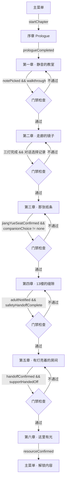
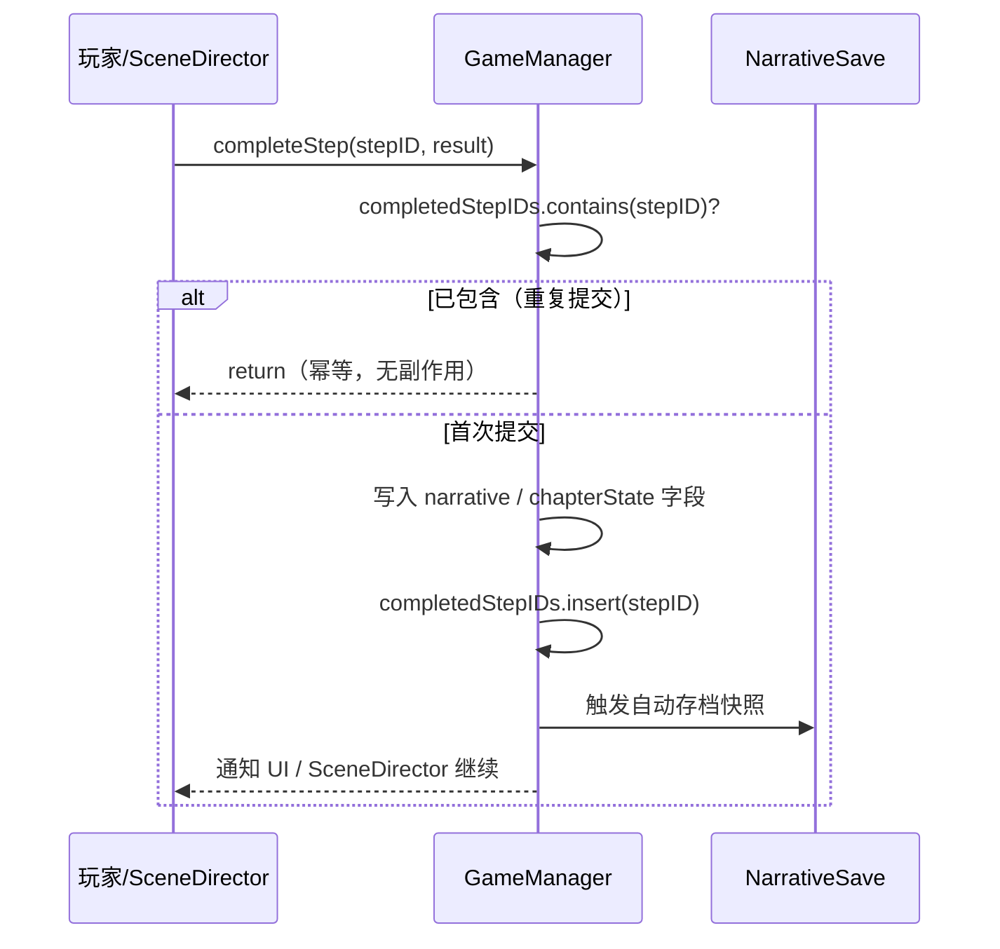
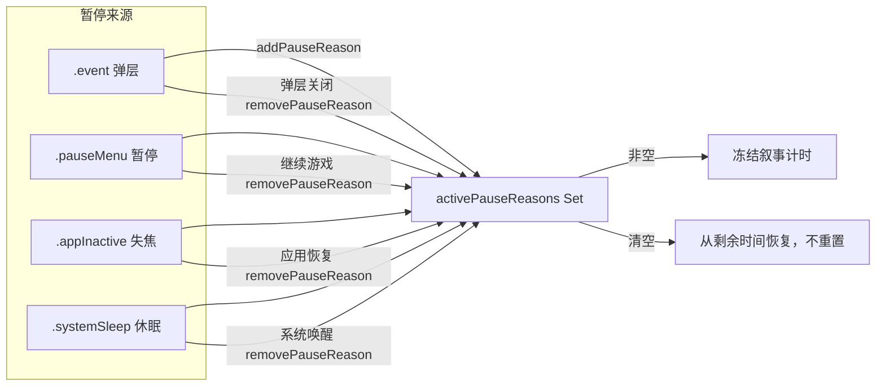

# F-01 叙事状态机与章节进度 — 业务流程

> 状态：final / accepted

## 主流程

### 章节转换状态机

### 步骤提交流程

### 多重暂停管理

## 边界与兜底

**存档损坏**
- `current` 槽解码失败 → 尝试 `lastValid`；两者均失败 → 从当前章合法入口重建并显示非阻塞提示
- 未知 `schemaVersion`（未来版本存档在旧版本读取）→ 拒绝解码，不猜测，不拼接不一致状态

**章节一致性校验失败**
- `chapterState` case 与 `quest.currentChapter` 不匹配 → 使用 `lastValid`；两者均异常 → 重建入口

**步骤越级**
- `transitionChapter` 校验未通过的门禁条件 → 返回 `false`，保持当前章，不执行 cleanup；SceneDirector 继续运行当前章 Beat

**应用在转场中断**
- `prepare` 阶段终止：无可见副作用，存档仍是旧章检查点，恢复后重放转场
- `commit` 阶段终止：存档状态未更新，恢复后重放转场
- `cleanup` 阶段终止：新章检查点已写入，恢复后只清理残留旧节点，不触发双重热点

**读档时的暂停状态处理**
- 移除存档中的 `.appInactive` / `.systemSleep`（生命周期状态由当前运行时决定）
- 保留 `.pauseMenu`（用户有意暂停）和 `.event`（若有覆盖层事件待处理）

## 与其他特性的交互点

| 时机 | 调用方向 | 交互内容 |
|---|---|---|
| F-01 提供协议 `NarrativeQuestManaging` | F-02 SceneDirector 依赖 | SceneDirector 调用 `completeStep`、`addPauseReason`、`removePauseReason`；不直接修改状态字段 |
| F-01 提供 `quest` 和 `narrative` | F-03 MainQuestHUD 订阅 | HUD 读取 `@Published quest` 渲染当前目标；只读，不写 |
| F-01 提供 `ScenePresentationState` 引用 | F-04 叙事相机依赖 | F-04 定义 `ScenePresentationState` 和 `NarrativeCameraMode`，F-01 在 `NarrativeSave` 中持有其快照 |
| F-01 提供 `transitionChapter` | 各章功能（F-05、F-08–F-19）调用 | 章节逻辑完成后通过 `transitionChapter` 触发章节切换，由 F-01 执行门禁并写入存档 |
| F-01 提供 `GameNarrativeState.companionChoice` | F-14 同伴 NPC 读取 | 同伴选择写入全局字段，F-14 读取并驱动 NPC 跟随行为 |
| F-01 提供 `safetyRoute` / `jiangYueActualRisk` | F-17 安全路线分流读取 | F-17 读取编剧风险事实决定路线，写回 `safetyRoute` 后由 F-01 存档机制持久化 |
| F-01 提供结局相关字段 | F-19 结局选择逻辑读取 | `EndingSelector` 读取 `GameNarrativeState` 的累积事实生成结局；不回写 F-01 管理的字段 |
