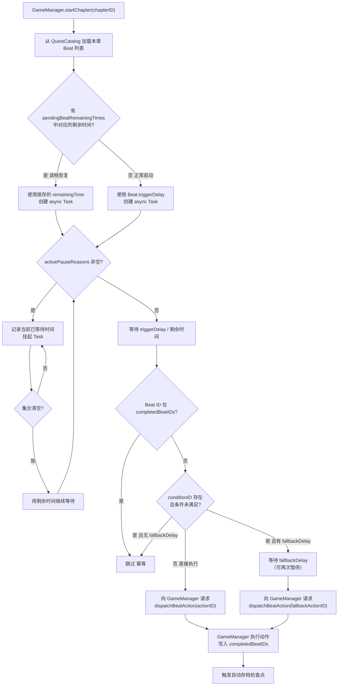
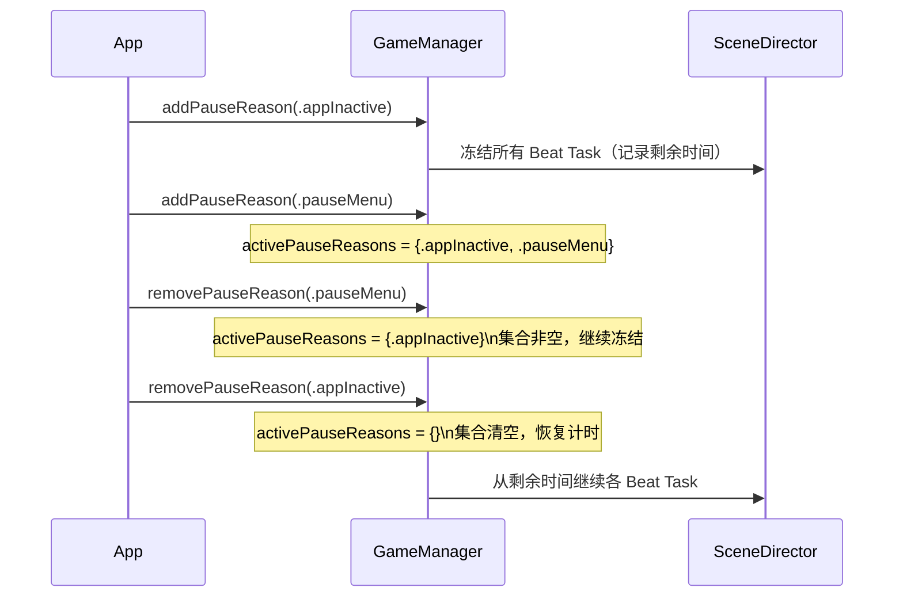

# F-02 SceneDirector 节拍系统 — 业务流程

> 状态：final / accepted

## 主流程

### Beat 生命周期

### 多重暂停交错

## 边界与兜底

| 场景 | 处理方式 |
|---|---|
| 玩家操作与 fallback Beat 同帧到达 | `completeStep` 幂等，Beat ID 写入 `completedBeatIDs` 后第二个到达者直接跳过，不产生重复状态写入 |
| 应用进入后台时 Beat 正在等待 | `addPauseReason(.appInactive)`，`pendingBeatRemainingTimes` 随 `NarrativeSave` 写入 UserDefaults |
| 存档恢复时 `.appInactive/.systemSleep` 在集合中 | 恢复时从集合移除这两项，再根据当前应用状态决定是否重新插入 |
| 章节切换 / 返回菜单 / 读档 | 调用 `cancelAllBeats()`，清空本章 `pendingBeatRemainingTimes` 条目，旧 Task 立即取消 |
| Beat 定义中 `conditionID` 对应逻辑未注册 | GameManager 在 `evaluateBeatCondition` 中返回 `false`，由 fallback 路径或无 fallback 的跳过逻辑处理，不崩溃 |
| `completedBeatIDs` 与 `pendingBeatRemainingTimes` 中同一 Beat ID 并存 | 恢复时跳过已完成 Beat 的 Task 重建，以 `completedBeatIDs` 为准 |
| 第四章高危/紧急路线触发 | 安全响应 Beat 通过具名 Task cancellation 强制取消普通倒计时 Beat，不依赖优先级 |

## 与其他特性的交互点

| 时机 | 调用方向 | 涉及特性 |
|---|---|---|
| `GameManager.startChapter` 时 | F-01 → F-02：触发 SceneDirector 注册本章 Beat | F-01 |
| 序章各段落 Beat 超时兜底 | F-02 → F-01：`dispatchBeatAction` → `completeStep` | F-05（序章 Beat 定义） |
| 第一章 noteDrop Beat 触发 | F-02 → F-01/F-10：派发 `noteDrop` 动作 | F-10（林澈 NPC 与纸条事件） |
| `.event` 覆盖层激活/关闭 | F-01 ↔ F-02：插入/移除 `.event` 暂停原因 | F-01（GameState 管理） |
| 第四章高危路线分流 | F-17 → F-02：取消普通倒计时 Beat，注册安全响应 Beat | F-17（安全路线分流） |
| 第四章江越对话超时 | F-02 → F-16：fallback Beat 触发同伴自动联系方老师 | F-16（江越对话与信任） |
| 存档写入 `pendingBeatRemainingTimes` | F-02 → 存档系统：每步骤完成后、章节切换前随 `NarrativeSave` 持久化 | F-01（存档 schema） |
