# F-05 序章 Beat 状态机 — 业务流程

> 状态：final / accepted

## 主流程

```mermaid
flowchart TD
    S([startPrologue]) --> B0

    B0["gateArrival\n受控入场演出 ~55s\n仅暂停/设置"]
    B0 -->|演出完成| B1

    B1["lookDownHall\n视角教学 ~40s\n允许转头"]
    B1 -->|玩家转向走廊并停留| Done1{幂等完成}
    B1 -->|12s未完成| FB1[苏念自然侧身向走廊看]
    FB1 --> Done1
    Done1 -->|写 lookTutorialCompleted| B2

    B2["returnToSeat\n移动教学 ~45s\n允许WASD/路径点"]
    B2 -->|玩家走到第三排座位| Done2{幂等完成}
    B2 -->|12s未移动| FB2[苏念自动走回座位]
    FB2 --> Done2
    Done2 -->|写 movementTutorialCompleted| B3

    B3["placeWater\n交互教学 ~35s\n允许靠近+确认"]
    B3 -->|玩家靠近水杯并确认| Done3{幂等完成}
    B3 -->|12s未操作| FB3[苏念自行放下水杯]
    FB3 --> Done3
    Done3 -->|写 interactionTutorialCompleted| B4

    B4["studyHallRhythm\n教室演出 ~2m15s\n允许转头/暂停"]
    B4 -->|演出完成| B4w[写 openingViewed]
    B4w --> B5

    B5["noticeLinChe\n观察教学 ~40s\n允许转头"]
    B5 -->|向左看停留1s| Done5{幂等完成}
    B5 -->|10s未完成| FB5[苏念自动注意林澈]
    FB5 --> Done5
    Done5 --> B6

    B6["settleBreath\n自我照顾 ~35s\n确认/跳过"]
    B6 -->|按呼吸键或选跳过| Done6{幂等完成}
    B6 -->|10s未操作| FB6[苏念安静坐好]
    FB6 --> Done6
    Done6 -->|suNianSelfCared 不写入| B7

    B7["accessibility\n辅助设置 ~40s\n打开设置或确认继续"]
    B7 -->|玩家打开设置或按继续| Done7{幂等完成}
    Done7 -->|写 accessibilityTutorialAcknowledged| B8

    B8["bellBeforeClass\n铃响前半秒 ~55s\n允许转头/暂停"]
    B8 -->|演出完成| End
    End([写 prologueCompleted\ntransitionChapter .classroom\nHUD 切换为第一章])
```

## 边界与兜底

**暂停（任意节拍）**

F-02 SceneDirector 的 `activePauseReasons` 集合插入对应原因（`.pauseMenu` / `.appInactive` / `.systemSleep` / `.event`）；所有受控 Beat 计时冻结，环境音循环可继续。集合清空后从保存的剩余时间恢复，不重新计时。

**存档恢复**

只恢复到段落开头检查点，不恢复到镜头转场中间。`completedBeatIDs` 中已有的节拍 ID 不重新执行。已完成标记（`PrologueState` 字段）从 `NarrativeSave` 直接读出。

**玩家与兜底同时触发**

`completePrologueBeat` 幂等：同一 `PrologueBeatID` 第二次调用立即返回，不产生重复状态写入或重复 Beat 启动。

**accessbility 节拍玩家未打开设置**

玩家可直接按"继续"跳过，`accessibilityTutorialAcknowledged` 仍写入 `true`（视为"玩家确认了解辅助设置入口"）；设置可在正式关卡任意时刻打开。

**序章中途关闭应用**

下次启动读取 `NarrativeSave`，若 `chapterState == .prologue(state)` 且 `state.prologueCompleted == false`，继续从最后稳定检查点进入序章（不弹"是否从头开始"）。

**`bellBeforeClass` → 第一章 HUD 切换失败**

若 `transitionChapter(.classroom)` 在切换前检测到 `MainQuestProgress` 或 `ChapterRuntimeState` 不一致，回退到 `bellBeforeClass` 检查点，显示一次非阻塞提示；不允许以错误的初始状态进入第一章。

## 与其他特性的交互点

| 时机 | 交互目标 | 说明 |
|---|---|---|
| `startPrologue()` 调用时 | F-02 SceneDirector | 注册 9 条 `SceneDirectorBeatDefinition` |
| 每段节拍期间 | F-02 SceneDirector | 暂停/恢复、兜底触发、剩余时间存储 |
| 每段节拍期间 | F-04 叙事相机 | 按 `PrologueInputMode` 切换相机限制；studyHallRhythm 用 `.freeObserve`，lookDownHall/returnToSeat 分别用 look/move 限制 |
| `accessibility` 节拍触发时 | F-07 辅助设置面板 | 展示设置面板入口；F-05 只请求显示，不实现面板 UI |
| `bellBeforeClass` 完成时 | F-01 叙事状态机 | `transitionChapter(.classroom)` 校验完成门禁，提交 `NarrativeSave` |
| 序章全程 | F-06 校门/走廊场景 | gateArrival、lookDownHall 节拍在 F-06 提供的校门/走廊场景根节点内执行；F-05 不持有场景节点 |
| 第一章任意时刻 | F-08–F-10 第一章特性 | `PrologueState` 的教学完成标记决定第一章是否显示基础操作提示；F-05 只写标记，各章特性自行读取判断 |
