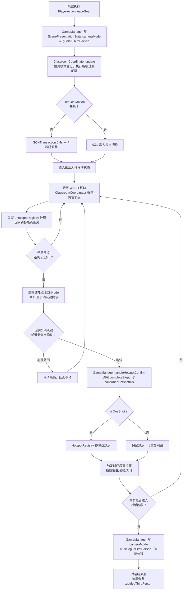

# F-13 引导第三人称移动与热点交互 — 业务流程

> 状态：final / accepted

## 主流程

## 边界与兜底

**玩家长时间不靠近热点（SceneDirector 兜底）：**
- 30 秒内无有效移动或热点交互：HUD 加强引导提示（目标文字变醒目，可选路径光出现）
- 45 秒（第三章软上限规则）仍未到达热点：SceneDirector 触发相机引导动画，短暂聚焦目标方向后归位
- 90 秒仍未确认：SceneDirector 调用对应 `completeStep`，结果附 `flags = ["softNoticed"]`，主线不断

**玩家靠近错误热点：**
- 高亮激活但玩家未按确认键：无任何状态写入，离开范围后高亮自然消失
- 不设惩罚，不触发负面事件

**应用失焦 / 暂停期间：**
- `activePauseReasons` 中插入对应原因，SceneDirector Beat 冻结
- 角色位置和相机偏移不变，`currentNearestID` 清空，恢复后由下一帧重新判断
- 热点高亮在暂停时隐藏，恢复后若玩家仍在范围内重新高亮

**从存档恢复：**
- `ScenePresentationState.cameraMode` 恢复为 `.guidedThirdPerson`
- `HotspotRegistry` 根据章节重新注册热点，过滤掉 `confirmedHotspotIDs` 中已完成的
- 相机节点由 `ClassroomCoordinator` 据 `checkpointID` 对应的场景锚点确定性重建
- 不恢复 `currentNearestID`，下一帧距离检测自动重建高亮状态

**章节转换中进入过渡动画时：**
- `prepare` 阶段清空 `HotspotRegistry`，禁止热点激活
- `commit` 完成后才注册新章热点
- 存档只落在 `commit` 后的稳定检查点，不落在过渡动画中间帧

## 与其他特性的交互点

| 时机 | 调用方向 | 说明 |
|---|---|---|
| F-04 写 `ScenePresentationState` | F-04 → F-13 | F-04 定义 `NarrativeCameraMode` 枚举和 `ScenePresentationState`，F-13 读取并响应 `cameraMode` 变化 |
| 玩家执行 `leaveSeat` | F-13 内部 | `GameManager` 写 `cameraMode = .guidedThirdPerson`，触发相机过渡 |
| F-14 同伴 NPC 跟随 | F-14 读取 F-13 | `CompanionFollowBehavior` 以玩家角色位置为目标，玩家位置由 F-13 的移动逻辑维护 |
| F-15 纸条调查步骤完成 | F-15 调用 F-13 热点 | 调查步骤（查桌面、观察声音来源）通过 F-13 的 `HotspotDefinition` + `completeStep` 完成，F-15 注册热点 ID |
| F-16 江越对话开始 | F-13 → F-16 | 楼梯间找到江越的热点确认后，`GameManager` 将 `cameraMode` 切为 `.dialogueFirstPerson`，F-16 接管对话流程 |
| SceneDirector 兜底（F-02） | F-02 触发 F-13 completeStep | 超时兜底时 SceneDirector 通过 `BeatActionID` 请求 `GameManager.completeStep`，路径与玩家主动确认相同，保证幂等 |
