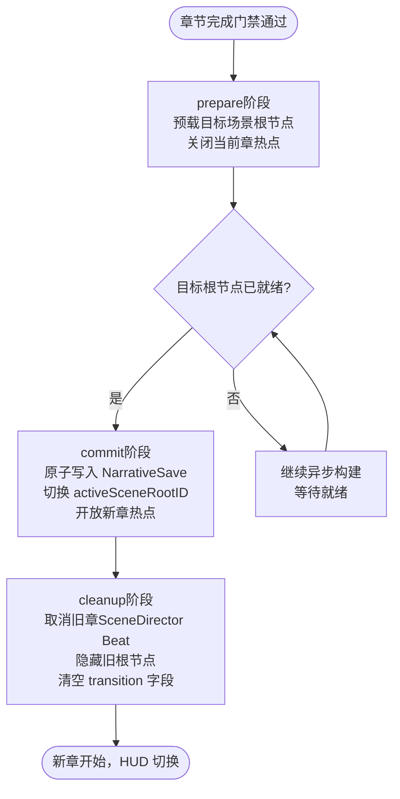
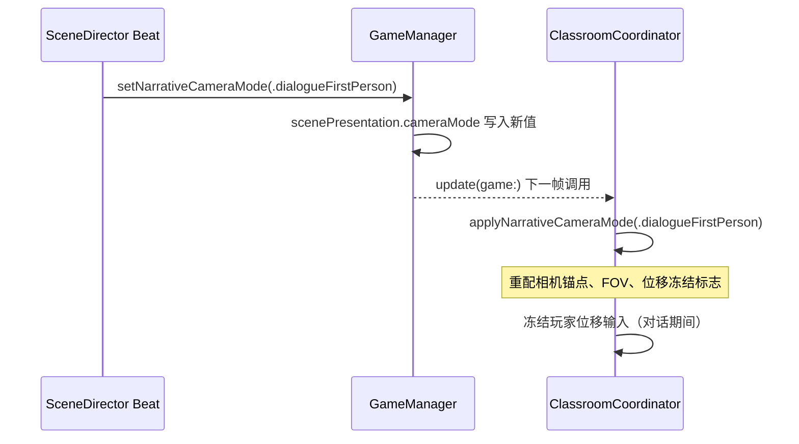

# F-04 叙事相机模式与场景呈现 — 业务流程

> 状态：final / accepted

## 主流程

### 相机模式选择（章节入口时）

每章入口的默认 `NarrativeCameraMode` 由 `GameManager.startChapter(_:)` 写入 `ScenePresentationState`，规则如下：

| 章节 | 入口默认 cameraMode | activeSceneRootID |
|---|---|---|
| 序章 | `seatedFirstPerson` | `"classroom"` |
| 第一章 | `seatedFirstPerson` | `"classroom"` |
| 第二章（教室→走廊） | `seatedFirstPerson` → `mirrorFirstPerson`（进镜像时切换） | `"corridor"` |
| 第三章 | `guidedThirdPerson` | `"classroom"` |
| 第四章 | `guidedThirdPerson` → `dialogueFirstPerson`（找到江越后切换） | `"stairwell"` |
| 第五章 | `waitingSeated` | `"counseling"` |
| 第六章 | `guidedThirdPerson` → `waitingSeated` | `"corridor"` → `"counseling"` |

章内模式切换（如第四章找到江越后从 `guidedThirdPerson` 切为 `dialogueFirstPerson`）由相应章节的 SceneDirector Beat 触发，调用 `GameManager.setNarrativeCameraMode(_:)`，写入 `ScenePresentationState` 后由 Coordinator 在下一帧响应。

---

### 章节转场三阶段协议

关键规则：
- `commit` 必须在主线程同步执行，整个写入过程不跨帧拆分。
- 热点开关在 `prepare`（关旧）和 `commit` 完成后（开新）各操作一次，两章热点不同时可交互。
- `cleanup` 中旧根节点设为 `isHidden = true`，不从场景图删除（保留重用）。

---

### 应用内相机模式切换（章内）

对话结束后，同样通过 `setNarrativeCameraMode` 恢复到章节默认模式（如 `guidedThirdPerson`）。

---

## 边界与兜底

| 场景 | 兜底策略 |
|---|---|
| 应用在 `prepare` 阶段失焦/终止 | 恢复到上一个稳定检查点（转场前），旧场景根保持可见，新场景根保持隐藏 |
| 应用在 `commit` 阶段失焦/终止 | 由于 `commit` 在主线程同步完成，理论上不产生中间态；若恢复时检测到 `transition != nil`，按损坏存档处理，回退 `lastValid` |
| 目标场景根节点构建超时（如资源加载慢） | `prepare` 阶段设 3 秒超时；超时后回退，向用户显示非阻塞提示，不强制跳转 |
| `NarrativeCameraMode` 旧版存档缺少新 case | 迁移器将未知 case 映射为该章默认模式（`seatedFirstPerson`），不崩溃 |
| `Reduce Motion` 开启时收到复杂转场请求 | `prepareTransition` 入口将 `colorTemperatureFlip` 和 `mirrorRipple` 替换为 `fade(duration: 0.3)` |
| 玩家在转场动画播放期间尝试交互 | 热点已在 `prepare` 阶段关闭，输入系统处于受限状态，操作被静默忽略直到 `commit` 完成 |

## 与其他特性的交互点

| 时机 | 本特性的角色 | 交互特性 |
|---|---|---|
| `GameManager.startChapter(_:)` 被调用时 | 接收初始 `ScenePresentationState` 并触发转场 | F-01（章节状态机提供 `ChapterID`） |
| SceneDirector 触发章内相机切换时 | 接收 `setNarrativeCameraMode` 调用并更新 `ScenePresentationState` | F-02（SceneDirector 发起调用） |
| 序章校门/走廊场景切入时 | 提供 `activeSceneRootID = "entranceHall"` 激活新场景根 | F-06（校门/走廊场景依赖本特性的场景根调度） |
| 第二章进入镜像空间时 | 切换为 `mirrorFirstPerson` 并执行 `colorTemperatureFlip` 转场 | F-11（镜像空间场景依赖本特性的相机模式） |
| 第三章起身行走时 | 切换为 `guidedThirdPerson` | F-13（引导第三人称移动依赖本特性定义的模式标识） |
| 第五章等候区入口时 | 提供 `waitingSeated` 模式及独立相机锚点 | F-18（等候区系统依赖本特性的视角限制配置） |
| F-21 多平台适配激活时 | `NarrativeCameraMode` 定义层已无平台专属依赖，可注入 iPad 相机参数 | F-21（前置条件） |
