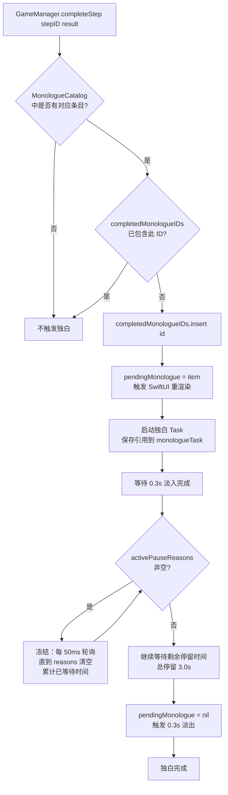
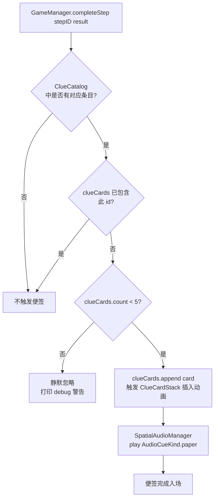

# F-09 内心独白与线索便签 — 业务流程

> 状态：final / accepted

## 主流程

### 内心独白触发与播放

### 线索便签触发与叠加

## 边界与兜底

| 场景 | 处理方式 |
|---|---|
| 玩家操作与 fallback 同帧命中同一步骤 | `completeStep` 幂等（F-01 保证），只调用一次 `presentMonologue` / `appendClueCard`；`completedMonologueIDs` 去重作为第二道防线 |
| 暂停期间独白正在播放 | 轮询冻结，恢复后剩余时间继续；若暂停时独白尚未开始（Task 刚启动），从头等待淡入阶段 |
| 恢复存档（load save） | `pendingMonologue` 重置为 nil，`completedMonologueIDs` 清空；`clueCards` 从 `NarrativeSave` 恢复并直接展示，不重播音效和动画 |
| 章节切换 | `startChapter(_:)` 清空 `completedMonologueIDs`，cancel `monologueTask`，reset `pendingMonologue = nil` |
| 便签上限（5 张）溢出 | 静默忽略，不 crash，不截断现有便签 |
| 手写字体缺失 | `InnerMonologueView`（F-03 负责实现）回退系统斜体，独白内容不受影响 |
| 步骤 4 根据对话结果选不同独白 | `completeStep` 的 `QuestStepResult.choiceID` 携带选项标识（如 `"B"`），`GameManager` 据此从 `MonologueCatalog.ch1` 取 `ch1.step4.b.linCheOpen` 或 `ch1.step4.other` |

## 与其他特性的交互点

| 时机 | 本特性调用/被调用 | 对方特性 |
|---|---|---|
| F-03 提供 `presentMonologue`/`appendClueCard` 方法签名 | 本特性在步骤完成时调用这两个方法 | F-03 主线任务 HUD |
| 第一章步骤 1-5 完成 | 本特性在 `GameManager` 的 `completeStep` ch1 分支中调用独白和便签接口 | F-10 林澈 NPC 与纸条事件（F-10 的步骤完成走同一 `completeStep` 路径，F-09 的内容定义先于 F-10 的 NPC 动画挂钩存在） |
| 第三章步骤 1-2 完成 | 本特性定义 ch3 独白/便签常量，F-15 的步骤完成逻辑调用时引用这些常量 | F-15 纸条调查链 |
| 任意 `addPauseReason` / `removePauseReason` | 本特性的独白 Task 轮询 `activePauseReasons`，由 F-02 SceneDirector 和事件系统写入 pause reason | F-02 SceneDirector 节拍系统 |
| 读档恢复（`NarrativeQuestManaging` 加载） | 本特性运行态属性随 `startChapter` 重置，`clueCards` 从 `NarrativeSave` 直接赋值 | F-01 叙事状态机（存档读写） |
